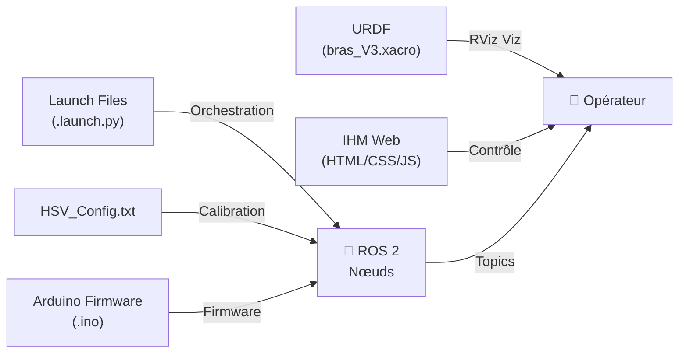

# Ressources du Projet RoboCup RMS - Documentation

## 📋 Vue d'ensemble

Ce document décrit l'organisation et l'utilité de toutes les ressources non-code du projet (images, fichiers URDF, konfiguration, documentation, etc).

---

## 📁 Structure des Ressources

### **1. Images & Visuels**

#### **`src/IHM_Robot/photos/`** - Ressources d'interface

| Fichier | Utilité | Dimension | Format |
|---------|---------|-----------|--------|
| `UVSQ.png` | Logo UVSQ (en-tête site) | ~200x100px | PNG transparent |
| `robot.png` | Icône du robot (navigation) | ~64x64px | PNG |
| `fleche_haut.png` | Bouton directionnel ↑ | ~100x100px | PNG |
| `fleche_bas.png` | Bouton directionnel ↓ | ~100x100px | PNG |
| `fleche_gauche.png` | Bouton directionnel ← | ~100x100px | PNG |
| `fleche_droite.png` | Bouton directionnel → | ~100x100px | PNG |

**Utilisation** : Interface web `deplacement_robot.html`

---

#### **`src/Bras_Manuel/screen/`** - Schémas d'orientation bras

Documentation visuelle des positions possibles du bras en mode manuel :

| Fichier | État du Bras | Utilité |
|---------|---|---|
| `Barre_centre.png` | Bras horizontal centré | Référence position neutre |
| `Barre_Gauche.png` | Bras horizontal à gauche | Limite rotation gauche |
| `Barre_Droite.png` | Bras horizontal à droite | Limite rotation droite |
| `Omni_Haut.png` | Configuration "haut" | Position pour atteindre objets hauts |
| `Omni_Bas.png` | Configuration "bas" | Position pour atteindre sol |
| `Omni_Bas_Gauche.png` | Diagonal bas-gauche | Position combinée |
| `Omni_Bas_Droite.png` | Diagonal bas-droite | Position combinée |

**Utilisation** : Aide aux opérateurs pour visualiser les limites de mouvement

---

### **2. Fichiers URDF (Robot Description)**

#### **`src/Bras_Manuel/urdf/`**

[URDF](http://wiki.ros.org/urdf) = Universal Robot Description Format (XML)

| Fichier | Type | Rôle | État |
|---------|------|------|------|
| `bras.urdf` | URDF statique | Description géométrique complète du bras | ✅ |
| `bras_V2.xacro` | URDF paramétrique (Xacro) | Génère bras_V2.urdf avec macros | ⚠️ Ancienne version |
| `Bras_V3.xacro` | URDF paramétrique (Xacro) | **Version actuelle** - Macros + variables | ✅ |

**Contenu URDF typique** :
```xml
<robot name="bras_rescue">
  <link name="base_link">
    <visual>...</visual>  <!-- Géométrie 3D -->
  </link>
  <link name="segment_1">...</link>
  <joint name="joint_1" type="revolute">
    <parent link="base_link"/>
    <child link="segment_1"/>
  </joint>
</robot>
```

**Utilisation** :
- RViz (visualisation 3D dans ROS)
- Planificateur de trajectoires
- Simulation MoveIt

---

### **3. Fichiers de Configuration**

#### **Root du projet**

| Fichier | Contenu | Rôle |
|---------|---------|------|
| `package.xml` | Métadonnées ROS 2 | Description du paquet, dépendances |
| `CMakeLists.txt` | Configuration CMake | Compilation des nœuds C++ |
| `HSV_Config.txt` | Paramètres de seuillage | Valeurs HSV pour détection d'objets |

#### **`HSV_Config.txt`** (Exemple)

```
# Paramètres de calibration HSV pour objets bleus
LowH: 100
HighH: 130
LowS: 50
HighS: 255
LowV: 50
HighV: 255

# Paramètres pour obstacles (rouges)
Obstacle_LowH: 0
Obstacle_HighH: 10
```

**Générée par** : Script `opencv3_V2_node` (tuner interactif)

---

### **4. Fichiers de Lancement (Launch)**

#### **`launch/` ou `src/*/launch/`**

[ROS 2 Launch Files](https://docs.ros.org/en/humble/Concepts/Intermediate/Launch-files.html) = orchestration des nœuds

| Fichier | Format | Rôle | Lancement |
|---------|--------|------|-----------|
| `Bras.launch` | XML (ROS 1) | Lancer nœud Bras | ❌ ROS 1 obsolète |
| `bras_manuel.launch.py` | Python (ROS 2) | Lancer Bras Manuel +GUI | ✅ Actif |
| `bras_automatique.launch.py` | Python (ROS 2) | Lancer Bras Automatique | ✅ Actif |
| `Lidar.launch` | XML (ROS 1) | Lancer Lidar | ❌ À migrer |
| `Lidar.launch.py` | Python (ROS 2) | Lancer Lidar ROS 2 | ✅ Actif |
| `Rescue.launch` | XML | Lancer scenario complet rescue | ❌ À vérifier |
| `Flux_8MP.launch` | XML | Configuration caméra 8MP | ❌ À migrer |

**Exemple Python launch** :
```python
def generate_launch_description():
    return LaunchDescription([
        Node(
            package='bras_manuel',
            executable='bras_manuel_node',
            name='bras_ik',
            output='screen'
        ),
        Node(
            package='bras_manuel',
            executable='slider_node.py',
            name='slider_gui'
        )
    ])
```

---

### **5. Documentation Textuelle**

#### **`README.md`** (Racine)
- État du projet
- Instructions build ROS 1 (❌ obsolète, à mettre à jour ROS 2)

#### **À créer/mettre à jour**
```
README.md                 # Vue générale projet ROS 2
src/*/README.md           # Documentation par module
ARCHITECTURE.md           # Schéma général/topics/services
SETUP.md                  # Installation deps + build
LAUNCH_GUIDE.md           # Comment lancer les scenarios
```

---

### **6. Fichiers Arduino & Microcontrôleurs**

#### **`src/Bras_Manuel/src/Arduino/`**

[.ino = Arduino Sketch files](https://www.arduino.cc/)

| Fichier | Objectif | Composant |
|---------|----------|-----------|
| `Bras_ROS_Mega.ino` | Firmware Bras | Arduino Mega 2560 |
| `sabertooth_autonom.ino` | Firmware Locomotion | Arduino Mega (Sabertooth driver) |

**Contiennent** : Initialisation capteurs, boucles de contrôle bas-niveau

---

### **7. Scripts Utilitaires**

#### **`scripts/`** (Racine du projet)

| Script | Type | Rôle |
|--------|------|------|
| `launch_all.sh` | Bash | Démarre tous les nœuds ROS 2 |
| `ros` | Shell/alias | Alias ou shortcut ROS |
| `ros.pub` | Python/Bash | Utilitaires publication topics |

**Exemple `launch_all.sh`** :
```bash
#!/bin/bash
# Lance tous les modules du robot

ros2 launch rms_lidar Lidar.launch.py &
ros2 launch bras_manuel bras_manuel.launch.py &
ros2 launch camera_economique rescue.launch.py &
ros2 launch detection_mouvement detection_mouvement.launch.py &

wait
```

---

### **8. Librairies Externes**

#### **`matplotlib-cpp/`**
Binding C++ pour Matplotlib (graphes en temps réel)

**Utilité** : Tracé courbes, debug données capteurs

---

### **9. Fichiers de Données**

#### **`src/Bras_Manuel/`**

| Fichier | Contenu |
|---------|---------|
| `Commandes.txt` | Exemples séquences commandes servo |
| `Ranges_moteurs` | Tableauplages mouvement par servo |
| `Read_me` | Instructions bras manuel |

---

### **10. Fichiers .svg / Diagrammes**

*(Non trouvés actuellement, mais devraient exister)*

**À créer** :
- Diagramme architecture ROS2 (topics/services/nœuds)
- Schéma cinématique bras
- Plan circuit PCB robot

---

## 🎯 Utilité Globale des Ressources



---

## 🔄 Workflow Maintenance Ressources

### **Avant chaque démonstration**
- [ ] Valider URDF avec `urdf_to_graphviz bras_V3.xacro`
- [ ] Vérifier `HSV_Config.txt` (calibration couleurs)
- [ ] Tester `.launch.py` files
- [ ] Documenter changes dans git commit

### **Lors d'ajout nouveau composant**
- [ ] Ajouter geometry URDF + joints
- [ ] Créer image/screenshot pour doc
- [ ] Ajouter nœud launch file
- [ ] Updater `ARCHITECTURE.md`

---

## 📊 État des Ressources (CheckList)

| Ressource | État | À Faire |
|-----------|------|---------|
| **URDF** | ✅ V3 existe | Valider/tester |
| **Calibration HSV** | ⚠️ Hard-codée | Externaliser config |
| **IHM Web** | ✅ Complète | Tester rosbridge |
| **Launch ROS 2** | ✅ Partiellement | Migrer XML → Python |
| **Arduino Firmware** | ⚠️ Dupliqué | Nettoyer versions |
| **Documentation** | ❌ Quasi-absente | Créer README modules |
| **Images** | ✅ Présentes | Bien organisées |
| **Scripts** | ⚠️ Basiques | Améliorer robustesse |

---

## 👥 Auteurs & Responsables

- **Projet** : RoboCup Rescue MT5 ISTY (2024-2025)
- **Responsable Ressources** : À identifier
- **Dernière maj** : 19 mars 2026

---

**Voir aussi** :
- [📖 Documentation IHM](./src/IHM_Robot/README_IHM.md)
- [📖 Documentation Arduino](./src/Bras_Manuel/README_ARDUINO.md)
- [📖 Guide Architecture ROS 2](./ARCHITECTURE.md) *(À créer)*
